# PicoCart64-Notes

Some collected information about [PicoCart64](https://github.com/kbeckmann/PicoCart64) (Nintendo 64 flash cart using a Raspberry Pi Pico / RP2040).

> **ℹ️** I am quite new to this project. Feel free to contribute and gather information here 😉

## Short introduction

The [PicoCart64](https://github.com/kbeckmann/PicoCart64) simulates a PAL or NTSC N64 game cartridge and can hold one game or homebrew up to 16 MB regarding to flash chip size of used Pico board. The original RPI Pico RP2040 has 2MB of flash memory. Other variants can have 4, 8(?) or 16MB of flash memory.

## Links

* [Github: PicoCart64 Project by Konrad Beckmann](https://github.com/kbeckmann/PicoCart64)
* [PicoCart64 on Discord](https://discord.gg/CGTjxkVr7P)
* [Hack64 - N64 ROM Swapper: .n64/.v64 to .z64](https://hack64.net/tools/swapper.php)
* [PicoCart64 UF2 ROM Builder with flash instructions](https://kbeckmann.github.io/PicoCart64/)
* [N64 Games by cartridge size on www.nintendo64ever.com](https://www.nintendo64ever.com/Nintendo-64-32-Mb-Cartridge-Games.html)

## How to flash the PicoCart64

A detailed description is available on [PicoCart64 UF2 ROM Builder](https://kbeckmann.github.io/PicoCart64/) site. There is a step by step instruction what is to do.

## PicoCart64 variants

### PicoCart64 lite by Konrad Beckmann

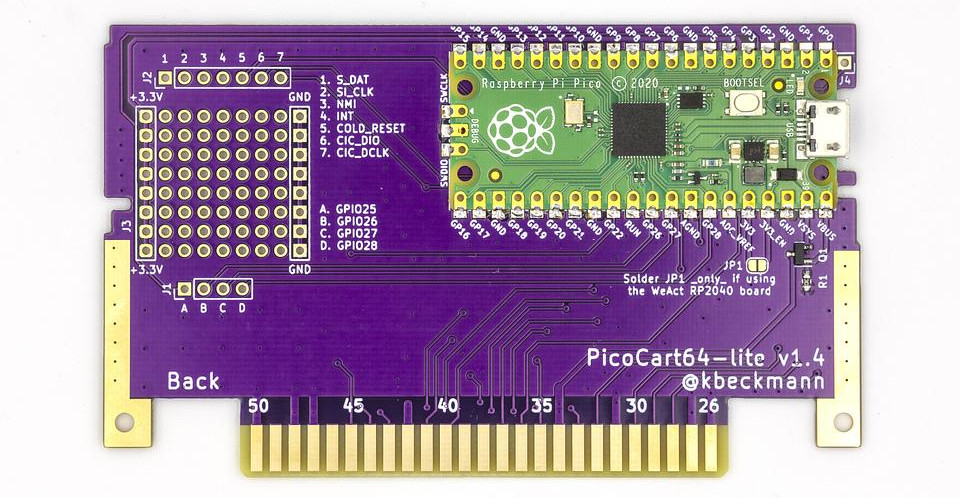
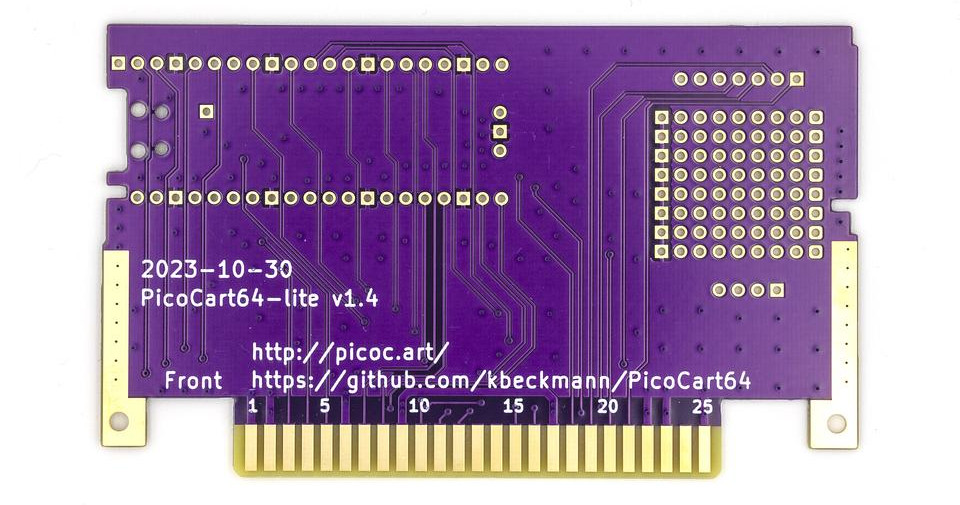

### PicoCart64 by YueCheng

> Can be purchased on Aliexpress. Could not find any source (e.g. homepage, documentation, schematics, pcb layout) about this board.
> **Important:** Apparently non-functioning boards are being sold. A non-pin compatible Picoboard is may be the reason.

### PicoCart64 the pragmatic way by [XGAMES VIDEOJUEGOS](https://www.youtube.com/@DAVIDXGAMESmx)

> This one uses a original game rom pcb to solder a pico to it.

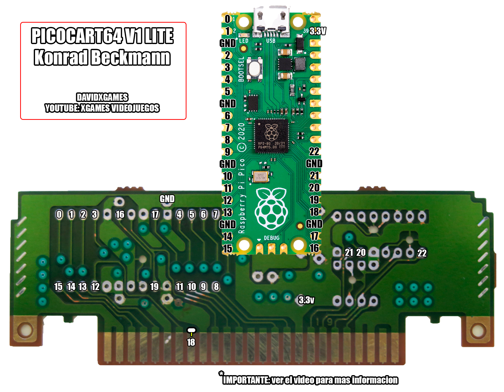
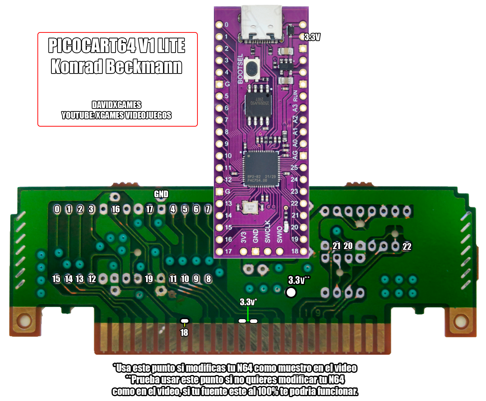

## PicoCart64 forks

### [N64cart - N64 flash cartridge](https://github.com/pdaxrom/N64cart)

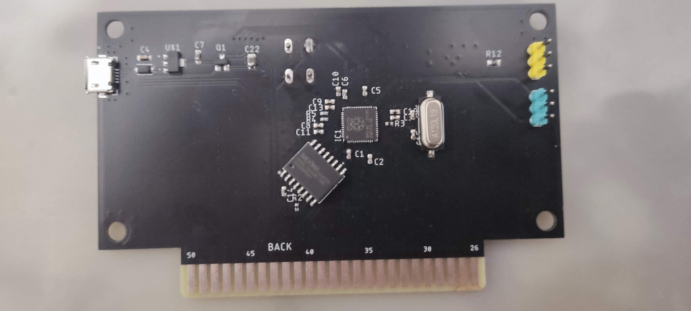
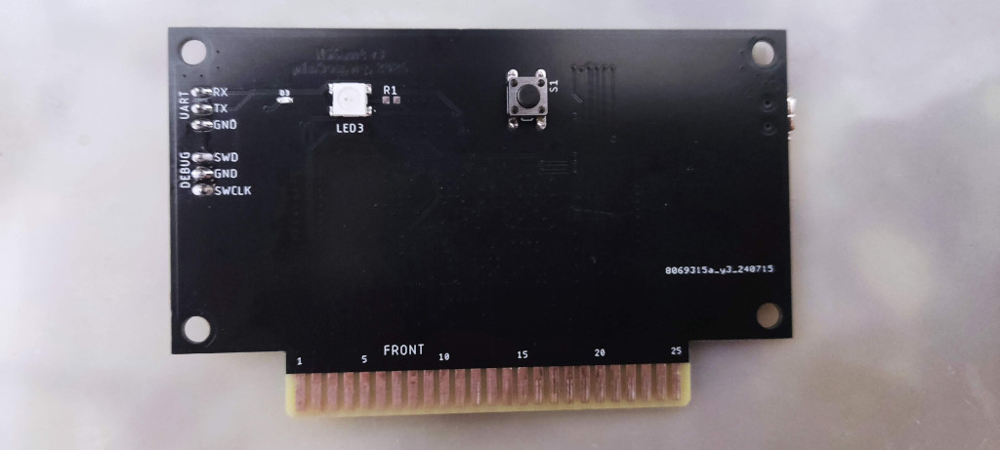

## PicoCart64 alternatives

### [SummerCart64 - a fully open source N64 flashcart](https://github.com/Polprzewodnikowy/SummerCart64)

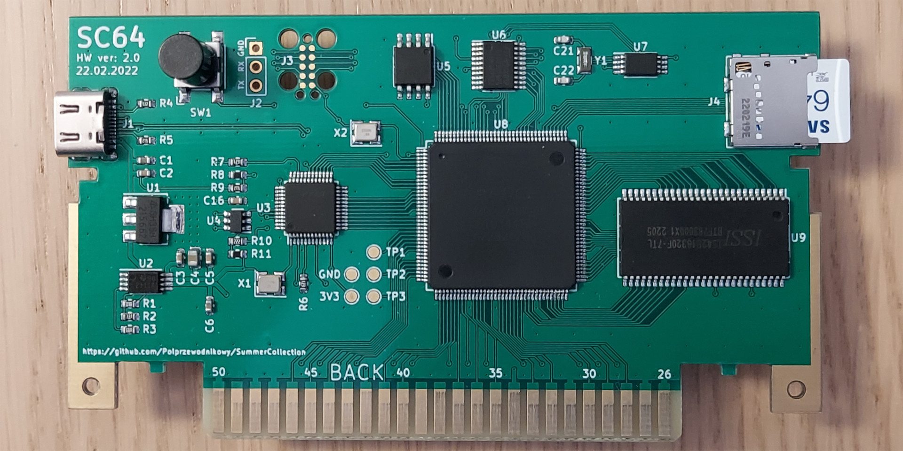
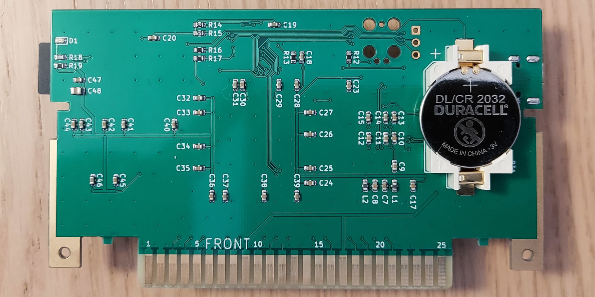

## Pico board pinouts

### RPI Pico

### WeAct RP2040

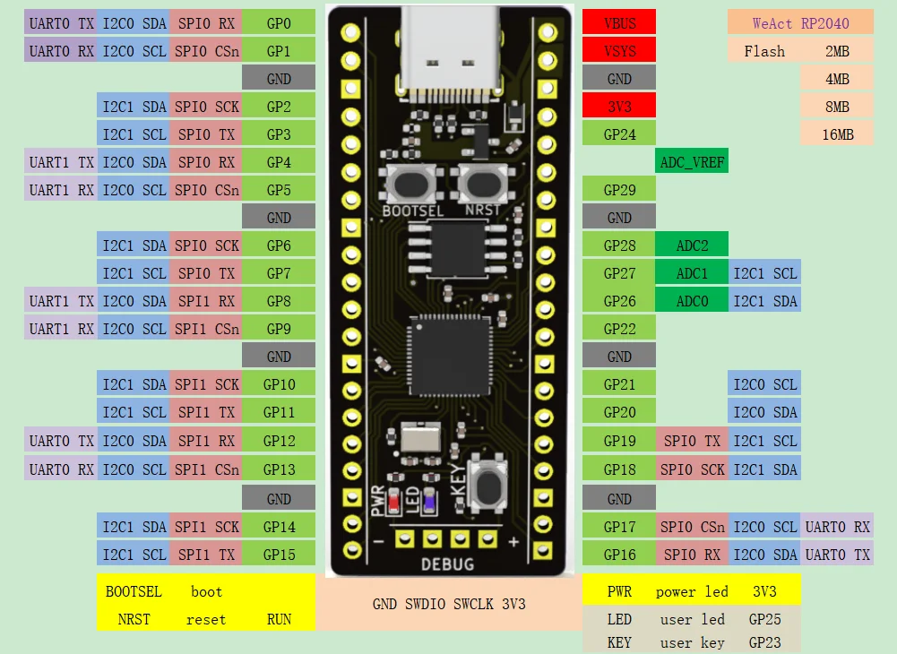

### Bitfunx Picoboot RP2040

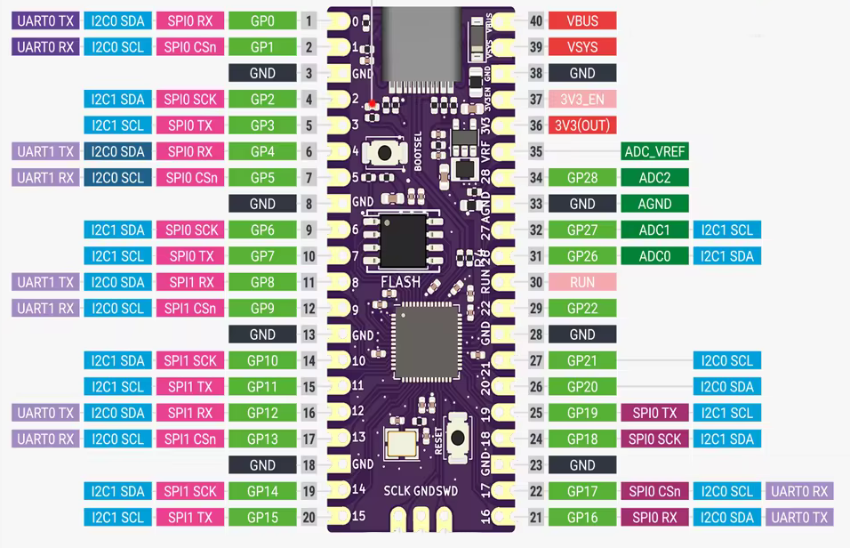

## Workarounds/Troubleshooting PicoCart64 lite

First of all solder the [PicoCart64 lite](https://github.com/kbeckmann/PicoCart64) as described [here](https://github.com/kbeckmann/PicoCart64). Flash the stuff you want or the testrom of [PicoCart64](https://github.com/kbeckmann/PicoCart64). If you get a black screen after powering on the N64, try it again with connected USB cable to check if it is a power problem.
If the [PicoCart64 lite](https://github.com/kbeckmann/PicoCart64) is working now it must be a power related issue.
Is the monitor still black it is maybe a pinout issue of the used Pico board.

### WeAct RP2040

If WeAct on PicoCart64 lite will not work try to remove the BSS84 and solder a jumper wire to VSYS (see below). Also the removed jumper JP1 worked for me.

> **⚠️ Important:** the BSS84 acts like a protection(?) for the N64 3.3v line. If removed do not flash a game rom onto PicoCart64 lite if inserted into N64 over USB cable. This can break your N64!

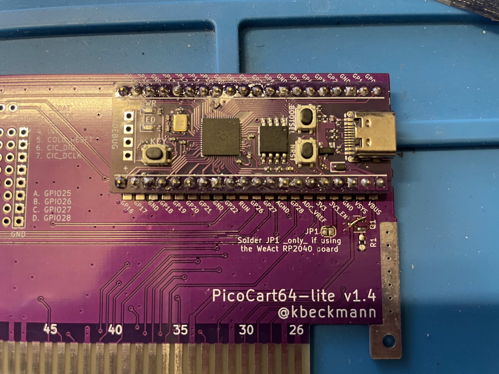

### Bitfunx Picoboot RP2040

If Bitfunx on PicoCart64 lite will not work try to remove the BSS84 and solder a jumper wire to VBUS (see below).

> **⚠️ Important:** the BSS84 acts like a protection(?) for the N64 3.3v line. If removed do not flash a game rom onto PicoCart64 lite if inserted into N64 over USB cable. This can break your N64!

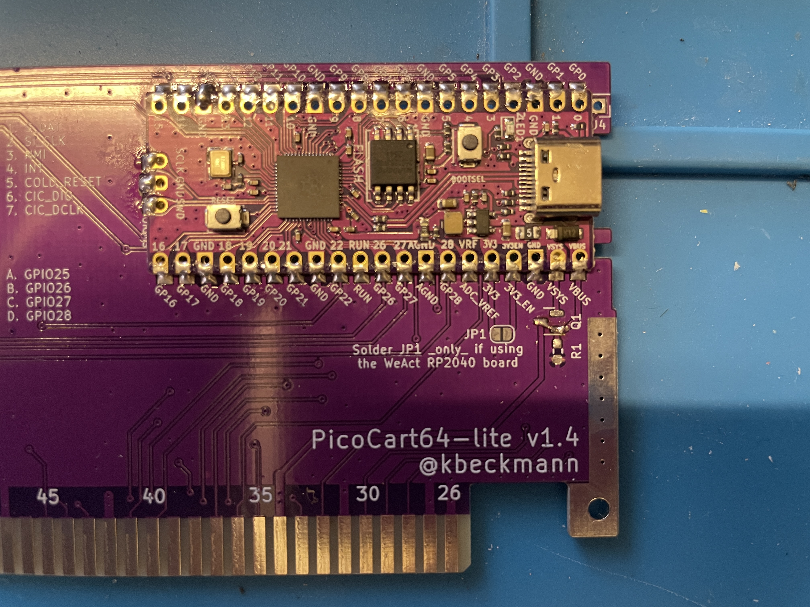

## Cartridge case

### [Thingiverse: N64 Cartridge (Retrostage/ N64 Blaster)](https://www.thingiverse.com/thing:4462321)

> Seems to be a little bit too thick (printed on my printer) but can be inserted into the N64. 

### [Thingiverse: N64 cartridge shell redux](https://www.thingiverse.com/thing:5153622)

> Fits perfect.

